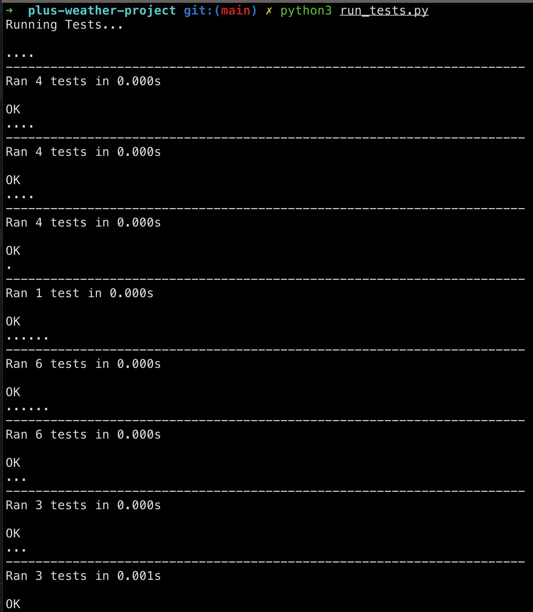

# Plus Resources: Weather Project Template

Starter code for the Plus Weather project.

## TODO
- [x] Implement the methods in `weather.py`.
- [x] Verify that everything works as intended by running the tests with `python run_tests.py`.

### Screenshot
**run_tests_result**
